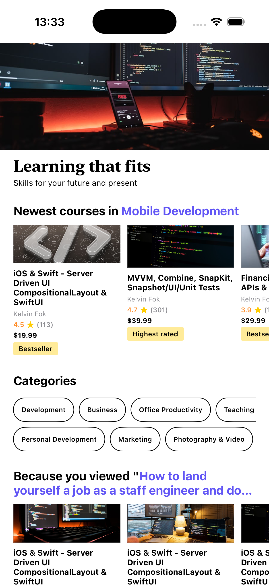

# Udemy-Home-Screen

A dynamic iOS application demonstrating Server-Driven UI principles. I built a responsive home screen using UICollectionViewCompositionalLayout and DiffableDataSource to handle complex layouts, including horizontal scrolling sections. Data is fetched and parsed from a JSON payload to dynamically drive the UI components

Layout: Implemented multi-directional scrolling (orthogonal sections) using Compositional Layout and SnapKit.
Data: Utilized a JSON-driven architecture to simulate a backend-to-frontend workflow.
Tools: Built with UIKit, SnapKit for constraints, and integrated SwiftUI modules.
State Management: Managed data updates efficiently with Diffable Data Source.

